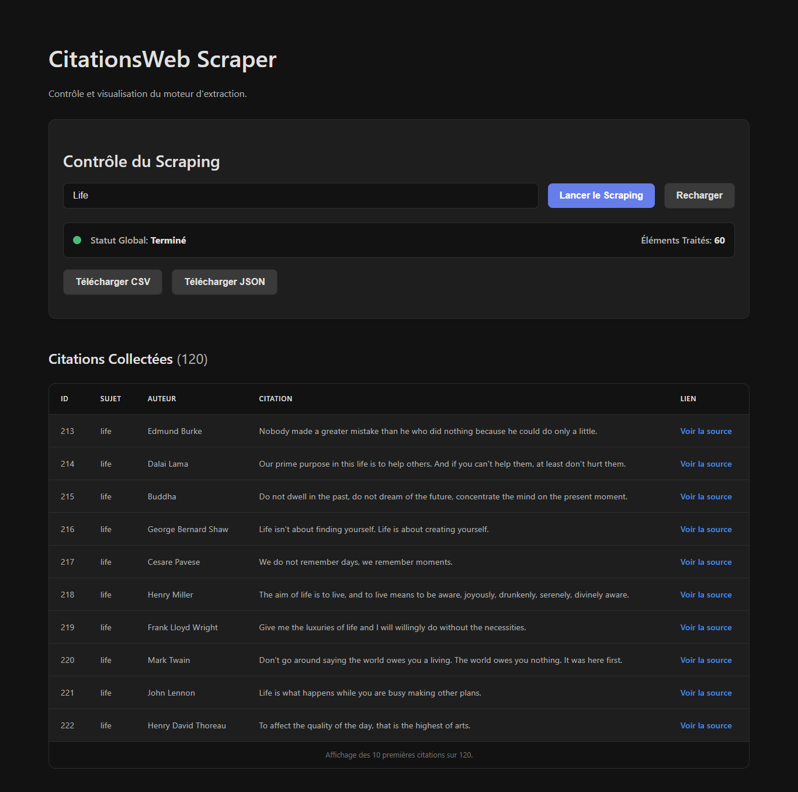

# CitationsWeb - Scraper de Citations

CitationsWeb est une application full-stack permettant de scraper des citations depuis des sites web, de les stocker et de les afficher via une interface web moderne.


- **Frontend** : Construit avec [Nuxt.js 3](https://nuxt.com/), offre une interface de contrôle réactive.
- **Backend** : Construit avec [FastAPI](https://fastapi.tiangolo.com/) (Python), gère le scraping de manière asynchrone.
- **Base de données** : Utilise [Supabase](https://supabase.com/) pour le stockage des données (PostgreSQL) et des images (Storage).

---

## 1. Prérequis

Assurez-vous d'avoir les outils suivants installés sur votre machine :
- [Python](https://www.python.org/downloads/) (version 3.8 ou supérieure)
- [Node.js](https://nodejs.org/en/) (version 18.x ou supérieure)
- [Git](https://git-scm.com/downloads/)

---

## 2. Configuration de Supabase

Le projet nécessite un projet Supabase pour fonctionner.

### Étape 1 : Créer un projet Supabase

1.  Rendez-vous sur [supabase.com](https://supabase.com/) et créez un nouveau projet.
2.  Conservez bien les informations de votre projet, notamment l'URL et les clés d'API.

### Étape 2 : Créer la table `quotes`

1.  Dans le tableau de bord de votre projet Supabase, allez dans l'éditeur SQL (`SQL Editor`).
2.  Cliquez sur `+ New query`.
3.  Copiez-collez le script SQL ci-dessous et exécutez-le pour créer la table `quotes` avec les bonnes colonnes et contraintes.

```sql
CREATE TABLE public.quotes (
    id BIGINT GENERATED BY DEFAULT AS IDENTITY PRIMARY KEY,
    created_at TIMESTAMPTZ DEFAULT now() NOT NULL,
    auteur_nom TEXT NOT NULL,
    texte_citation TEXT NOT NULL,
    lien_citation TEXT,
    url_image TEXT,
    sujet TEXT
);

-- Optionnel : Activer la sécurité au niveau des lignes (RLS) si vous prévoyez un accès public
ALTER TABLE public.quotes ENABLE ROW LEVEL SECURITY;
CREATE POLICY "Public quotes are viewable by everyone." ON public.quotes FOR SELECT USING (true);
```

### Étape 3 : Créer un Bucket de Stockage

1.  Dans le menu de gauche, allez dans `Storage`.
2.  Cliquez sur `Create a new bucket`.
3.  Nommez votre bucket (par exemple, `quote-images`). **Important :** Cochez la case `This bucket is public`.
4.  Notez le nom du bucket que vous avez choisi.

---

## 3. Installation et Lancement du Backend

Le backend doit être lancé en premier pour que le frontend puisse communiquer avec lui.

### Étape 1 : Cloner le projet

```bash
git clone <https://github.com/anonymousrod/CITATIONWEB.git>
cd CitationsWeb/backend
```

### Étape 2 : Configurer l'environnement

1.  **Créez un environnement virtuel** pour isoler les dépendances Python :
    ```bash
    python -m venv venv
    ```
2.  **Activez l'environnement** :
    -   Sur Windows (PowerShell) : `.\venv\Scripts\Activate.ps1`
    -   Sur macOS/Linux : `source venv/bin/activate`

### Étape 3 : Créer le fichier `.env`

1.  À la racine du dossier `backend`, créez un fichier nommé `.env`.
2.  Remplissez-le avec les informations de votre projet Supabase :

```env
# .env du Backend

# URL du projet Supabase (API > Project URL)
SUPABASE_URL="https://xxxxxxxxxxxx.supabase.co"

# Clé de service du projet Supabase (API > Project API Keys > service_role)
SUPABASE_SERVICE_KEY anon ="ey...xxx"

# Nom du bucket de stockage que vous avez créé
NOM_BUCKET_IMAGES="quote-images"

# Configuration de l'API (optionnel, valeurs par défaut)
API_HOST="127.0.0.1"
API_PORT=8000
```

### Étape 4 : Installer les dépendances

```bash
pip install -r requirements.txt
playwright install
```

### Étape 5 : Lancer le serveur Backend

```bash
uvicorn main:app --reload
```
Le backend est maintenant accessible à l'adresse `http://127.0.0.1:8000`. Vous pouvez vérifier son état en visitant `http://127.0.0.1:8000/docs`.

---

## 4. Installation et Lancement du Frontend

### Étape 1 : Se déplacer dans le dossier frontend

Ouvrez un **nouveau terminal** et placez-vous dans le dossier `frontend`.

```bash
cd ../frontend
```

### Étape 2 : Créer le fichier `.env`

1.  À la racine du dossier `frontend`, créez un fichier nommé `.env`.
2.  Remplissez-le avec l'URL de votre API backend.

```env
# .env du Frontend

# Doit correspondre à l'URL où votre backend tourne
NUXT_PUBLIC_BACKEND_URL="http://127.0.0.1:8000"
```

### Étape 3 : Installer les dépendances

```bash
npm install
```

### Étape 4 : Lancer le serveur Frontend

```bash
npm run dev
```
L'application est maintenant accessible dans votre navigateur à l'adresse `http://localhost:3000`.

---

## 5. Utilisation

1.  Ouvrez `http://localhost:3000`.
2.  Entrez un sujet de citation (ex: `life`, `funny`, `love`,,,,,,,,).
3.  Cliquez sur "Lancer le Scraping".
4.  Le statut de l'opération s'affichera, et les citations apparaîtront dans le tableau une fois le scraping terminé./rafraichir si necessaire/
